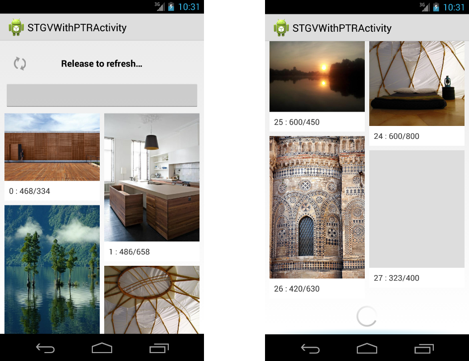

StaggeredGridView
=================

## A sweeter version of StaggeredGridView

This widget is based on [maurycyw/StaggeredGridView][1], which is a modification of Android's experimental StaggeredGridView: [com.android.ex.widget.StaggeredGridView][2]

This widget has fixed some of the major bugs and has some new features that you may be interested.

## Features

* Stability and high performance

  This widget fix some bugs of [maurycyw/StaggeredGridView][1]. Such as when fling the view, the scroll sometimes slow down and speed up later.

  Notice that the image loading also has a contribution to the perfomance. I use [square/Picasso][3], it gives the best performance I've ever seen.
* Header and Footer View and an Adapter to wrap all child views, Just like android.widget.ListView
* Load more when get to the bottom
* Work with PullToRefresh

  A compatible part to enable this widget to be pulled to refresh.

## Restriction

* You have to determine the dimension of each child view in the widget before the parent the child.measure()

  This is because the after the child is first time added to the parent widget, its size can not be changed later, otherwise it may cause gird misalign as you may have seen in [maurycyw/StaggeredGridView][1].
  
  eg. You want to display pictures in the widget, and the pictures are loaded from network. 
  If you set your picture container to WRAP_CONTENT, the size of the pic container may change when the picture is loaded, and this can cause gird misalige. 
  Unfortunately, the current methodology has nothing to do to fix this. 
  Instead, you can let this widget know the size of each child before the picture is actually downloaded. 
  You can do this by overwrite the onMeasure() method of the container.

* Load more is lazy

  When oad more, the widget only add new items to the old ones, the old ones is not reloaded.

* Screen rotation

  The widget may have problem holding the state when it is destroyed.
  Besides you may want to change the column number when the screen orientation changed, you'd better to rebuild the whole content again.

## Project structure

Project contains StaggeredGridView library, StaggeredGridView demo, modified PullToRefresh library to work with StaggeredGridView.
In order to avoid some depandency problems, I add the libs into one project, but it is easy to retrieve the libs.
* StaggeredGridView lib

  code: src/com.bulletoid.android.widget.StaggeredGridView
  
  res: res/stgv_*.xml
* PullToRefresh lib

  code: src/com.handmark.pulltorefresh.library
  
  res: res/ptr_*.xml

## Usage

Please refer to the Demo of how to use the widget and use it with PullToRefresh.

## Pictures in the demo are from Pinterest

[1]: https://github.com/maurycyw/StaggeredGridView
[2]: http://grepcode.com/file/repository.grepcode.com/java/ext/com.google.android/android/4.3_r2.1/com/android/ex/widget/StaggeredGridView.java?av=f
[3]: https://github.com/square/picasso
